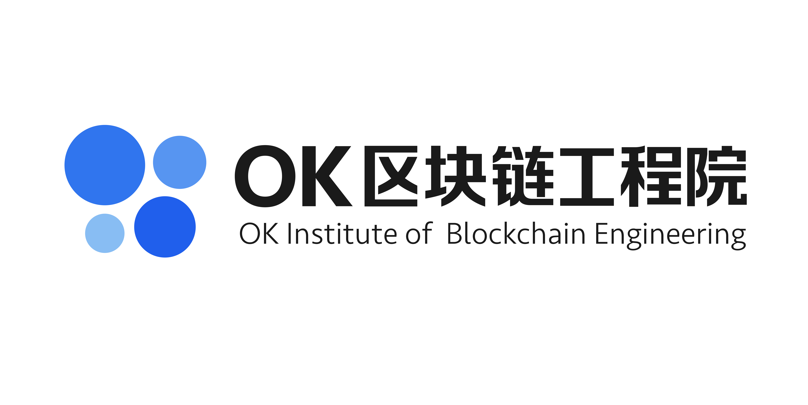

## Go Okchain
This is the Official Golang implementation of the Okchain protocol.



Overview - [Homepage](https://www.okcoin.com/chain)
==========================
[](travis-ci.org/xxx/xxx)

Okchain is a private, secure, decentralised digital currency. 

**Privacy:** Okchain uses a cryptographically sound system to allow you to send and receive funds without your transactions being easily revealed on the blockchain (the ledger of transactions that everyone has). This ensures that your purchases, receipts, and all transfers remain absolutely private by default.

**Security:** Using the power of a distributed peer-to-peer consensus network, every transaction on the network is cryptographically secured. Individual wallets have a 25 word mnemonic seed that is only displayed once, and can be written down to backup the wallet. Wallet files are encrypted with a passphrase to ensure they are useless if stolen.

This is the core implementation of Okchain. It is open source and completely free to use without restrictions, except for those specified in the license agreement below. There are no restrictions on anyone creating an alternative implementation of Okchain that uses the protocol and network in a compatible manner.

As with many development projects, the repository on Github is considered to be the "staging" area for the latest changes. Before changes are merged into that branch on the main repository, they are tested by individual developers in their own branches, submitted as a pull request, and then subsequently tested by contributors who focus on testing and code reviews. That having been said, the repository should be carefully considered before using it in a production environment, unless there is a patch in the repository for a particular show-stopping issue you are experiencing. It is generally a better idea to use a tagged release for stability.

## Implemented features
* Sharding, including network and transaction sharding
* PoW or VRSF for joining the network
* New BLS-pbft consensus mechanism
* Coinbase rewards
* Ecc-p256 signature and public address
* Supporting ethereum smart contracts
* Gossip protocol
* Node recovery mechanism

## Fulture features
* State sharding
* Support WASM-based smart contracts
* More Operating System supported
* More exciting features.

## Building Okchain
### Dependencies
The following table summarizes the tools and libraries required to build. A
few of the libraries are also included in this repository (marked as
"Vendored"). By default, the build uses the library installed on the system,
and ignores the vendored sources. However, if no library is found installed on
the system, then the vendored source will be built and used. The vendored
sources are also used for statically-linked builds because distribution
packages often include only shared library binaries (`.so`) but not static
library archives (`.a`).

| Dep          | Min. version  | Vendored | Debian/Ubuntu pkg  | Arch pkg     | Fedora  | Optional | Purpose  |
| ------------ | ------------- | -------- | ------------------ | ------------ | ------- | -------- | -------- |
| RocksDB      | 5.10.4         | NO       | `build-essential`  | `base-devel` | `gcc`             | NO       |                |

### Supported Operating System

| Operating System      | Processor | Status |
| --------------------- | --------  |--------|
| Ubuntu 16.04          |  amd64    | Supported
| OSX 10.13             |  amd64    | Supported
| Centos 7              |  amd64    | 2019 Q2
| Windows 10            |  amd64    | 2019 Q2


### Build from Source code
First, prepare the Go compiler:

```
brew install go
```

Then, clone the `okchain` repository to a specified directory:

```
git clone https://github.com/ok-chain/okchain
```

Finally, build the `okchaind` and `okchaincli` program using the following command.

```
cd okchain
make
```

Note: `okchaind` is the okchain node, which is to produce blocks and join the consensus process, etc. And `okchaincli` is a command-line tool to interacte with the `okchaind`.

### Run Okchaind using binaries

The build places the binary in `bin/` sub-directory within the build directory
from which cmake was invoked (repository root by default). To run in
foreground:

    ./bin/okchaind


To run in background:

    ./bin/okchaind --detach

### Run Okchain from docker

* Docker quick start

        docker run -d --name okchain/testnet-okchaind -v /okchain/chain:/root/.okchain \
                -p 15000:15000 -p 16000:16000  -p 25000:25000 \
                okchaind

* Startup a local testnet 

        cd go-okchain/wkdir/docker
        docker-compose up -d
        
### RocksDB

Instructions for debugging suspected blockchain corruption as per

There is an `mdb_stat` command in the RocksDB source that can print statistics about the database but it's not routinely built. This can be built with the following command:

`cd ~/okchain/external/db_drivers/liblmdb && make`

The output of `mdb_stat -ea <path to blockchain dir>` will indicate inconsistencies in the blocks, block_heights and block_info table.

The output of `mdb_dump -s blocks <path to blockchain dir>` and `mdb_dump -s block_info <path to blockchain dir>` is useful for indicating whether blocks and block_info contain the same keys.

These records are dumped as hex data, where the first line is the key and the second line is the data.


## More information

- Web: [okcoin.com/chain](https://www.okcoin.com/chain)
- Forum: [forum.okchain.org](https://forum.okchain.org)
- Mail: [dev@okcoin.com](mailto:dev@okcoin.com)
- GitHub: [https://github.com/ok-chain/okchain](https://github.com/ok-chain/okchain)


## Contributing

**Anyone is welcome to contribute to Okchain's codebase!** If you have a fix or code change, feel free to submit it as a pull request directly to the "master" branch. In cases where the change is relatively small or does not affect other parts of the codebase it may be merged in immediately by any one of the collaborators. On the other hand, if the change is particularly large or complex, it is expected that it will be discussed at length either well in advance of the pull request being submitted, or even directly on the pull request.

If you want to help out, see [CONTRIBUTING](CONTRIBUTING.md) for a set of guidelines.

Packaging for your favorite distribution would be a welcome contribution!

## License

Copyright (c) 2018-2019 The Okchain Project.   
More details, See [LICENSE](LICENSE).

